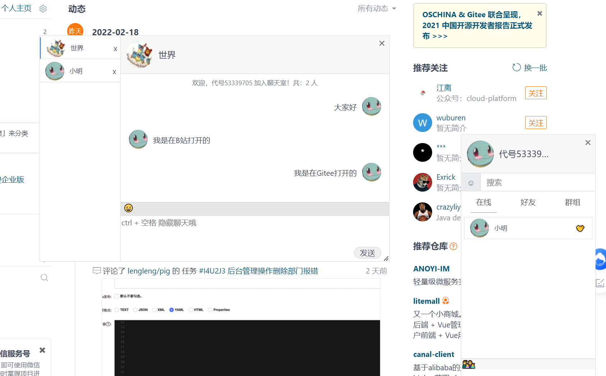
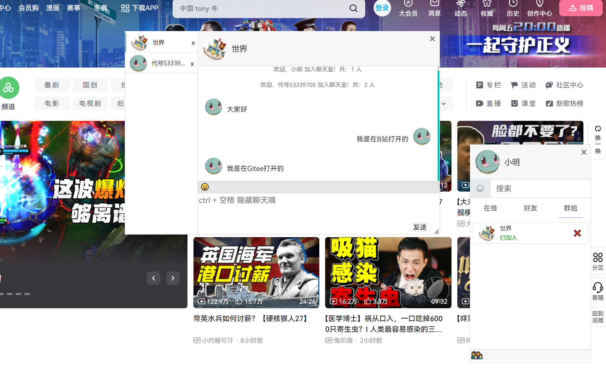
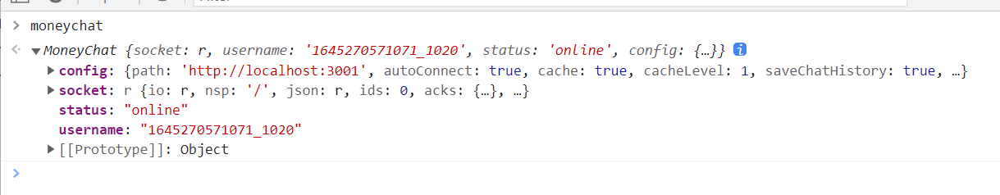

# 麦尼匿名聊天

麦尼匿名聊天是一个可以快速接入到任何项目和网页的 IM 即时聊天项目。可以轻松地加入到你的项目中，为用户提供即时通讯功能。欢迎前往体验！

 

## 环境

- 编程语言：Node.js 12.18.1
- Web框架：Express 4.17.1
- 模板引擎：Art-template 4.13.2
- 实时应用框架：Socket.io 2.3.0

## 模块

该项目分为三个主要模块：

1. 服务端程序
2. 客户端 JS 框架
3. 用户交互 UI

## 接入方式

无论采用何种方式接入，都需要启动服务端程序，即当前项目。

```bash
git clone <repository_url>
npm install
node money-chat-app.js
```

### 整套使用

通过服务端程序、客户端 JS 框架以及用户交互 UI 的整套方案，即可体验完整功能。

在其他项目的 JavaScript 部分加入以下代码。聊天室是无状态的，但可通过 `login` 方法传入接入系统的用户登录信息，固定名称和头像。

~~~js
function MoneyChatDriver(url='http://localhost:3001/driver/1.0.0') { 
	fetch(url).then(res => res.json()).then(json => { 
		document.body.insertAdjacentHTML('beforeend', json.html);
		let src = document.createElement('script');
		src.innerHTML = json.js;
		document.body.appendChild(src);
	});
}
MoneyChatDriver()
// 登录：将接入系统登录信息传入即可显示对应名称和头像
moneychat.login(name, username, avatar, callback(name, username)) 
~~~

### 自定义 UI

**服务端程序** + **客户端 JS 框架** + **用户交互 UI**

仅引入 JavaScript，通过提供的 API 获取聊天、用户等信息，自行绘制 UI。参考 API 文档。

```html
<script src="{basePath}/public/core/moneychat-base-1.0"></script>
```

### 直接嵌入式

通过 Ajax 请求获取 JavaScript 和 HTML，添加到当前页面。可在任何网页使用，比如在哔哩哔哩打开 F12，执行以下 JavaScript 代码，即可在哔哩哔哩页面看到聊天框。

 

*注意:* 一些网站无法使用，如百度、Github。

## 功能

### 好友列表

1. 当前在线（已完成）
2. 好友（已完成）
3. 聊天室（已完成）
   - 默认世界群聊
   - 点击群聊图标，输入相同号码进入同一房间

### 聊天方式

1. 私聊（已完成）
2. 群聊（已完成）

### 聊天功能

1. 文字 & Unicode 表情符号（已完成）
   - 字符串
2. 表情包、图片、文件
   1. 上传
   2. 生成 URL
   3. 发送
3. 视频
   - 使用 URL，放入 `<video>` 标签

### 其他功能

1. **缓存**（已完成）
   - 无缓存：每次刷新都是全新的账号 (**cache: false**)
   - sessionStorage：同一个标签页缓存，刷新后依然是同一个账号，当前标签页的聊天记录依旧存在 (**cache: true, cacheLevel: 1**)
   - localStorage：同一个浏览器缓存，刷新后依然是同一个账号，当前浏览器的聊天记录依旧存在 (**cache: true, cacheLevel: 2**)

   **注：** 是否缓存聊天记录 `saveChatHistory: true` 默认开启，需开启缓存才有效，否则仅缓存好友和聊天室。

   > 如果在 `money.login(name, username)` 时提供了名称和账号，则刷新后仍保持这些名称和账号。

### 默认UI模板：HTML占用元素

以下是整套使用时嵌入的UI所使用的元素选择器或属性。请尽量避免与被嵌入界面的选择器冲突，否则可能影响样式。

- 主盒子：**#MoneyChat**
- 聊天盒子：**#moneyBox**
  - 简略界面：**#mcMinBox**
  - 列表界面：**#mcBox**
    - 搜索结果：**#searchResult**
- 聊天主界面：**#chatWindow**
  - 聊天窗口列表：**#chatBoxList**（缓存聊天记录实际上是缓存了列表中的所有窗口）
    - 聊天窗口：**.chatBox**
  - 工具行：**#chatTool**
  - 输入框：**#moneyChatInput**
  - 发送按钮：**#sendGo**
- 扩展框：**#ext**
  - 加入/创建聊天室

**特殊属性：**

- **mc-name：** 自己的名字（初始化时，将具有此属性的标签内容更改为你的名字）
- **mc-user：** 存放唯一标识，如用户名或房间名
- **mc-user-name：** 存放昵称
- **mc-room：** 表示这是一个聊天室

# API 文档

对于不喜欢默认界面 UI 的用户，可以选择只引入**客户端 JS 框架**，通过 API 获取聊天的交互信息。API 设计简单，所有返回都是 JSON 对象，可以根据这些信息自行编写前端和 UI 交互。

## 引入依赖 JS 文件

```html
<script src="{basePath}/mc/socket.io.js"></script>
<script src="{basePath}/public/core/moneychat.js"></script>
```

或者

```html
<script src="{basePath}/public/core/moneychat-base-1.0"></script>
```

## 初始化

```js
const moneychat = new MoneyChat({
    path: '', // 服务端请求路径
    autoConnect: true, // 是否自动连接，关闭后需手动使用 open() 打开连接
    cache: false, // 是否缓存，配合 cacheLevel
    cacheLevel: 1, // 1：sessionStorage, 2: localStorage
    saveChatHistory: true, // 是否缓存聊天记录,
    tools: ['emoji', 'image', 'video', 'html'], // 聊天工具
    defaultNameFun: this.randomName, // 提供一个生成默认名称的算法
    loadCacheCallback: '', // 提供一个获取缓存后的回调方法，function loadCache(cache) cache: 缓存的数据
});
```

## 属性

 

**套接字 socket**

**用户名 username**

获取唯一的 username，初始化后即生成。在调用 login 函数时可更改，因此在 login 函数后获取的 username 才是当前使用的。

**状态 status**

- ‘online‘：上线
- ‘offLine’：离线

**配置 config**

一个 JSON 对象，可用于对 MoneyChat 进行配置，可配置参数：

- **path**：*‘’*， // ws 服务器地址
- **autoConnect**: *true*， // 是否自动连接，关闭后需手动使用 open() 打开连接
- **cache**: *false*， // 是否缓存，配合 cacheLevel
- **cacheLevel**: *1*， // 1：sessionStorage, 2: localStorage
- **saveChatHistory**: *true*， // 是否缓存聊天记录,
- **tools**: *['emoji', 'image', 'video', 'html']*， // 聊天工具
- **defaultNameFun**: *this.randomName*， // 提供一个生成默认名称的算法
-  **loadCacheCallback**: *''*， // 提供一个获取缓存后的回调方法，function loadCache(cache) cache: 缓存的数据

## 开启/上线

**login(name，username，avatar, callback(name, username))**

- name：昵称，默认为通过 defaultNameFun 方法生成的，默认是 *‘代号‘+时间戳*
- username：唯一标识，默认为随机 id
- avatar：头像 URL
- callback(name, username)：登录成功后的回调函数，带有参数 name 和 username
- return: name 返回昵称

> 在接入自己项目的时候，昵称和账户可由原本的项目登录返回的信息赋值，以确保每次用户使用的是同一个。但 username 必须是唯一的。

## 开启

**open()**

开启 socket，仅接收信息

## 关闭

**close()**

关闭后将不再接收任何信息

## 发送消息（私聊）

文本消息：

**send(msg, recv = [])**

- msg：消息内容
- Array recv：接收对象（单个直接传入接收者 username，会被封装为数组）

多媒体消息：

**sendMulti(msg, recv = [])**

- msg：消息内容
- Array recv：接收对象（单个直接传入接收者 username，会被封装为数组）

## 发送消息（群聊）

文本消息：

**sendToRoom(msg, recv = [])**

- msg：消息内容
- Array recv：接收对象（单个直接传入接收者 username，会被封装为数组）

多媒体消息：

**sendMultiToRoom(msg, recv = [])**

- msg：消息内容
- Array recv：接收对象（单个直接传入接收者 username，会被封装为数组）

## 加入聊天室

**joinRoom(room)**

- room: 聊天室名

## 离开聊天室

**leaveRoom(room)**

- room: 聊天室名

## 事件监听

**addEventListener(type, callback(msg))**

- type: 事件类型
- callback(msg): 监听回调
  - msg：通常为 JSON 类型

例如：

```js
// 监听用户上线消息
moneychat.addEventListener('online', (msg) => {
    // 返回数组，第一次是所有当前在线用户，接下来每次有人登录都会收到信息
})
// 监听用户下线消息
moneychat.addEventListener('offline', (msg) => {
    // 有人离线
})
// 监听系统消息
moneychat.addEventListener('sys', (msg) => {})
// 监听私聊消息
moneychat.addEventListener('private', (msg) => {}) 
// 监听群聊消息
moneychat.addEventListener('room', (msg) => {})
```

## 查看/修改当前配置

**config(key , value)**

- 如果不传参数则返回当前配置
- 根据 key，value 进行配置修改

## 自定义随机昵称

默认：

```js
function randomName() {
    return '代号' + Math.floor(Math.random() * 1000000000)
}
```

自定义配置方式：

- 初始化时赋值配置 `defaultNameFun: yourFunctionName`
- 使用 `moneyChat.config('defaultNameFun', loadCache)` 方式配置

## 自定义加载缓存

1. 创建方法`loadCache(cache)`

   ```js
   // function loadCache([friends, rooms, chatHistroy]) {
   function loadCache(cache) { 
       let friends = cache.friends; // 获取缓存中的好友 [{username:'',name:''}]
       let rooms = cache.rooms; // 获取缓存中的聊天室 ['room1', 'room2']
       let chatHistory = cache.chatHistory; // 获取缓存中的聊天记录 html 文本(所有的 .chatBox 节点)
       // 自定义操作
       ...
   }
   ```

2. 进行配置 config.loadCacheCallback  
   - 方式一：初始化时赋值 `loadCacheCallback: yourFunctionName`
   - 方式二：使用 `moneyChat.config('loadCacheCallback', loadCache)` 方式配置 
